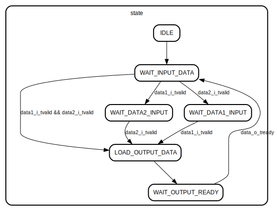

# Модуль: adder_axis_cu 
- **Файл**: adder_axis_cu.v

## Диаграмма

## Описание

Конечный автомат управления служебными сигналами сумматора
с AXI-Stream интерфейсами. Модуль упарвляет загрузкой данных
во внутренние регитры сумматора и формирует tvalid и tready
сигналы

## Порты

| Название   | Направление | Тип         | Описание                                          |
| ---------- | ----------- | ----------- | ------------------------------------------------- |
| aclk       | input       |             | тактовый сигнал                                   |
| aresetn    | input       |             | асинхронный сброс. активный уровень - 0           |
| data1_i_ce | output      |             | загрузка первого слагаемого во внутренний регистр |
| data2_i_ce | output      |             | загрузка второго слагаемого во внутренний регистр |
| data_o_ce  | output      |             | загрузка результата вы выходной регистр           |
| data1_i    | in          | Virtual bus |                                                   |
| data2_i    | in          | Virtual bus |                                                   |
| data_o     | out         | Virtual bus |                                                   |

### Виртуальные шины

#### data1_i

| Название       | Направление | Тип | Описание                         |
| -------------- | ----------- | --- | -------------------------------- |
| data1_i_tvalid | input       |     | сигнал валидности данных         |
| data1_i_tready | output      |     | сигнал готовности принять данные |
#### data2_i

| Название       | Направление | Тип | Описание                         |
| -------------- | ----------- | --- | -------------------------------- |
| data2_i_tvalid | input       |     | сигнал валидности данных         |
| data2_i_tready | output      |     | сигнал готовности принять данные |
#### data_o

| Название      | Направление | Тип | Описание                         |
| ------------- | ----------- | --- | -------------------------------- |
| data_o_tvalid | output      |     | сигнал валидности данных         |
| data_o_tready | input       |     | сигнал готовности принять данные |

## Сигналы

| Название | Тип       | Описание                     |
| -------- | --------- | ---------------------------- |
| state    | reg [2:0] | состояние конечного автомата |

## Константы

| Название          | Тип | Значение | Описание                                                        |
| ----------------- | --- | -------- | --------------------------------------------------------------- |
| IDLE              |     | 3'b000   | состояние сброса устройста                                      |
| WAIT_INPUT_DATA   |     | 3'b001   | состояние готовности получать слагаемые                         |
| WAIT_DATA1_INPUT  |     | 3'b010   | состояние после получения второго слагаемого и ожидание первого |
| WAIT_DATA2_INPUT  |     | 3'b011   | состояние после получения первого слагаемого и ожидание второго |
| LOAD_OUTPUT_DATA  |     | 3'b100   | состояние после получения слагаемых и формированя суммы         |
| WAIT_OUTPUT_READY |     | 3'b101   | состояние j;blfybz,когда следующий блок заберет результат суммы |

## Процессы
- FSM_State_Transition: ( @(posedge aclk or negedge aresetn) )
  - **Тип:** always
  - **Описание**
  логика перехода между состояними автомата 

## Конечные автоматы

- логика перехода между состояними автомата