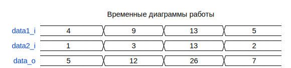

# Модуль: adder_comb 
- **Файл**: adder_comb.v

## Диаграмма

## Описание

Простой комбинационный параметризируемый беззнаковый сумматор.
Разрядность результата суммирования на один бит больше разрядности слагаемых.

 

## Параметры

| Название | Тип     | Значение | Описание              |
| -------- | ------- | -------- | --------------------- |
| WIDTH    | integer | 4        | разрядность слагаемых |

## Порты

| Название | Направление | Тип         | Описание           |
| -------- | ----------- | ----------- | ------------------ |
| data1_i  | input       | [WIDTH-1:0] | первое слагаемое   |
| data2_i  | input       | [WIDTH-1:0] | второе слагаемое   |
| data_o   | output      | [  WIDTH:0] | результат сложения |
