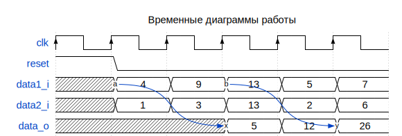

# Модуль: adder_regs 
- **Файл**: adder_regs.v

## Диаграмма

## Описание

Параметризируемый беззнаковый сумматор с регистровыми входами и выходом.

 

## Параметры

| Название | Тип     | Значение | Описание              |
| -------- | ------- | -------- | --------------------- |
| WIDTH    | integer | 4        | разрядность слагаемых |

## Порты

| Название | Направление | Тип         | Описание                            |
| -------- | ----------- | ----------- | ----------------------------------- |
| clk      | input       |             | тактовый сигнал                     |
| reset    | input       |             | сигнал сброса, активный уровень - 1 |
| data1_i  | input       | [WIDTH-1:0] | первое слагаемое                    |
| data2_i  | input       | [WIDTH-1:0] | второе слагаемое                    |
| data_o   | output      | [WIDTH:0]   | результат сложения                  |

## Сигналы

| Название   | Тип              | Описание                              |
| ---------- | ---------------- | ------------------------------------- |
| adder_in_1 | reg  [WIDTH-1:0] | первый вход комбинационного сумматора |
| adder_in_2 | reg  [WIDTH-1:0] | второй вход комбинационного сумматора |
| adder_out  | wire [  WIDTH:0] | выход комбинационного сумматора       |

## Процессы
- data1_i_reg: ( @(posedge clk) )
  - **Тип:** always
  - **Описание**
  входный регистр для первого слагаемого 
- data2_i_reg: ( @(posedge clk) )
  - **Тип:** always
  - **Описание**
  входный регистр для второго слагаемого 
- data_o_reg: ( @(posedge clk) )
  - **Тип:** always
  - **Описание**
  выходной регистр 

## Подключенные модули

- adder_comb: adder_comb
  -  комбинационный сумматор