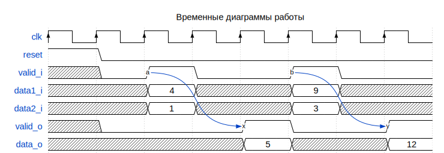

# Модуль: adder_valid_io 
- **Файл**: adder_valid_io.v

## Диаграмма

## Описание

Параметризируемый беззнаковый сумматор с входным и выходным строб-сигналом.

 

## Параметры

| Название | Тип     | Значение | Описание              |
| -------- | ------- | -------- | --------------------- |
| WIDTH    | integer | 4        | разрядность слагаемых |

## Порты

| Название | Направление | Тип         | Описание                            |
| -------- | ----------- | ----------- | ----------------------------------- |
| clk      | input       |             | тактовый сигнал                     |
| reset    | input       |             | сигнал сброса, активный уровень - 1 |
| valid_i  | input       |             | входной строб-сигнал                |
| data1_i  | input       | [WIDTH-1:0] | первое слагаемое                    |
| data2_i  | input       | [WIDTH-1:0] | второе слагаемое                    |
| valid_o  | output      |             | выходной строб-сигнал               |
| data_o   | output      | [WIDTH:0]   | результат сложения                  |

## Сигналы

| Название        | Тип       | Описание                                  |
| --------------- | --------- | ----------------------------------------- |
| valid_shift_reg | reg [1:0] | регистр сдвига для задержки строб-сигнала |

## Процессы
- valid_i_shift_reg: ( @(posedge clk) )
  - **Тип:** always
  - **Описание**
  задерживаем входной строб-сигнал на два такта для  выравния его с выходными данными 

## Подключенные модули

- adder_valid_i: adder_valid_i
  -  сумматор с входным строб-сигналом